# 🎨 HTML & CSS Practice Websites

This folder contains small website recreation challenges that I built to test my HTML & CSS skills after learning the fundamentals.

For each challenge:
- 🖼️ I was given only a reference image generated by AI.
- 💻 I recreated the webpage from scratch using **HTML & CSS**.
- 🚫 No AI-generated code or tutorials were used during implementation.
- 🎯 The goal was to improve my understanding of layouts, positioning, spacing, typography, and styling by recreating real webpage designs.

---

## 1. Personal Profile Card

| Reference | My Recreation |
|-----------|----------------|
| 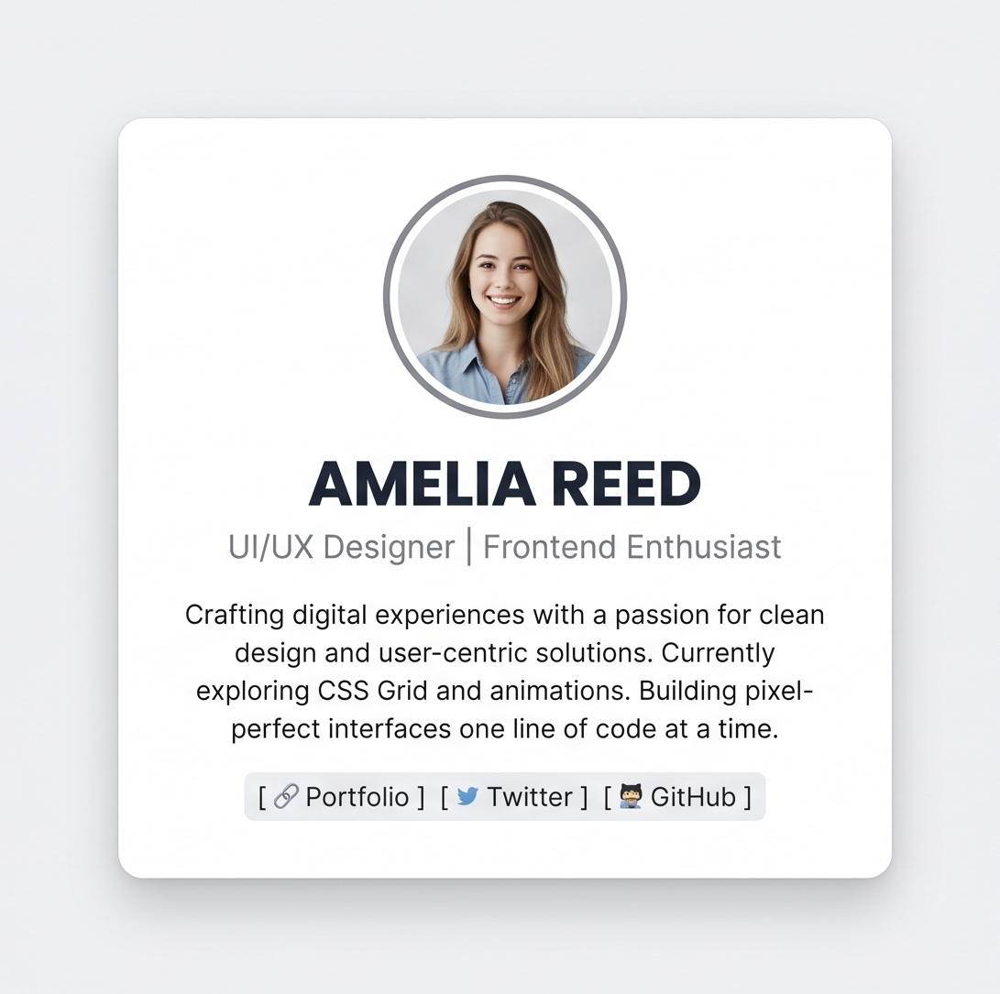 | 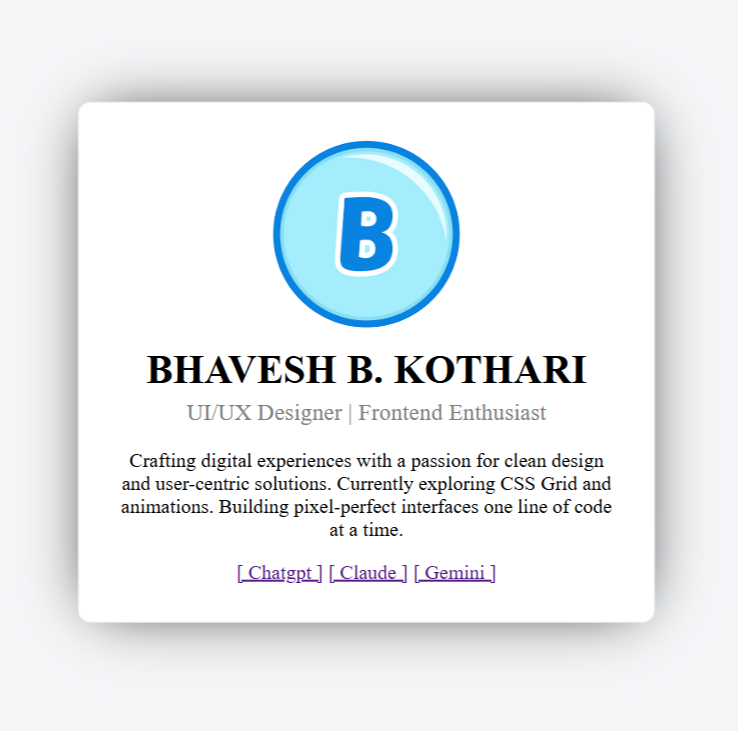 |

---

## 2. Restaurant Menu Page

| Reference | My Recreation |
|-----------|----------------|
| 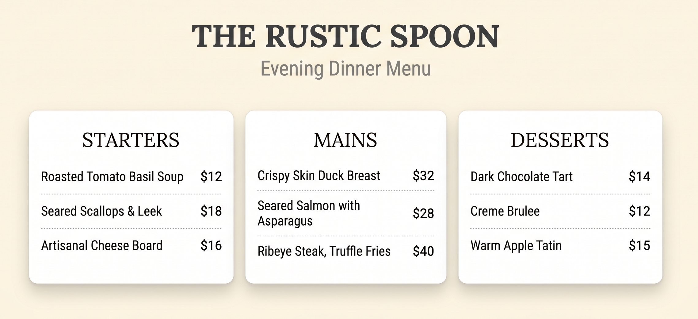 | 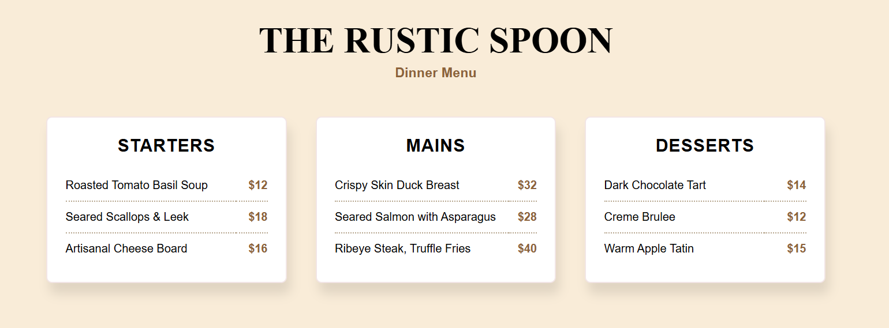 |

---

## 3. Product Landing Page (Hero Section)

| Reference | My Recreation |
|-----------|----------------|
| 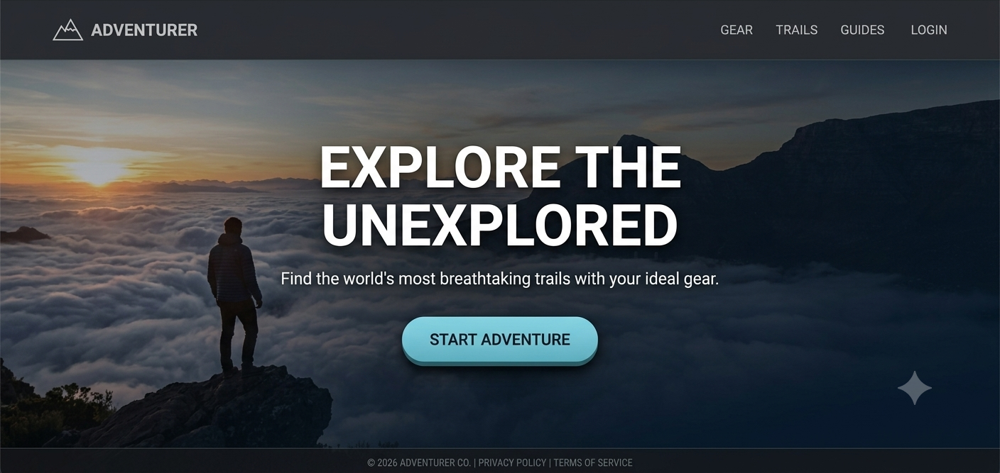 | 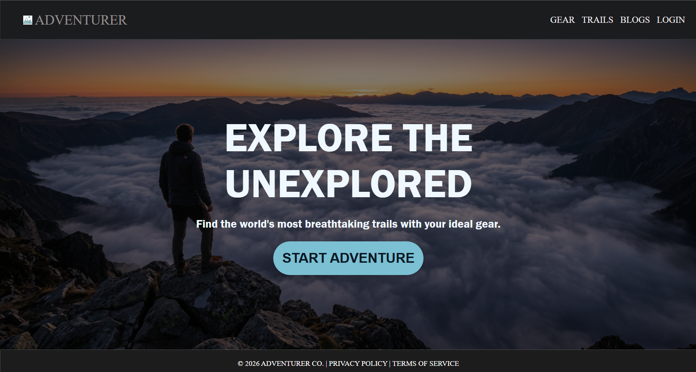 |

---

## 4. Sign-Up Page

| Reference | My Recreation |
|-----------|----------------|
| 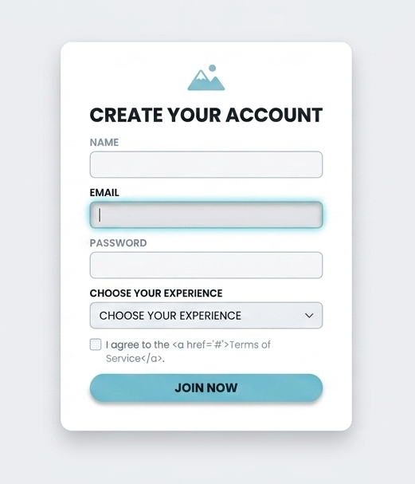 | 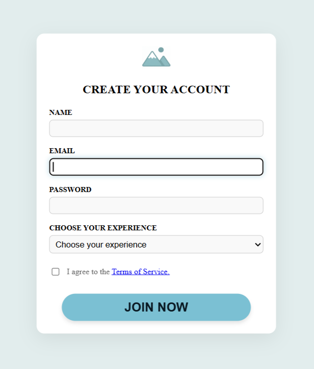 |

---

## 5. Blog Article Page

| Reference | My Recreation |
|-----------|----------------|
| 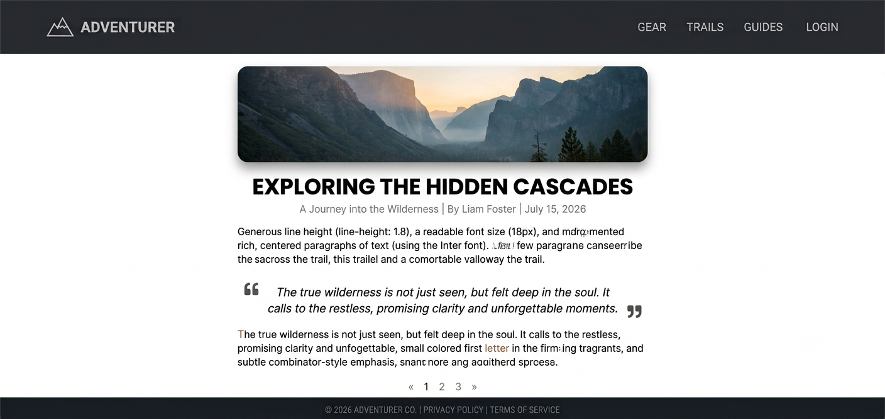 | 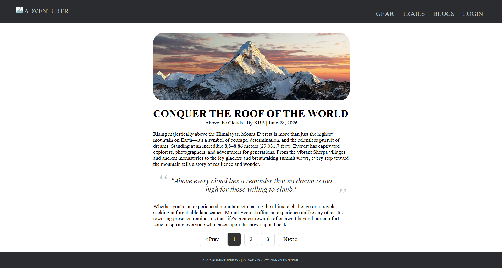 |

---

## 6. Pricing Page

| Reference | My Recreation |
|-----------|----------------|
| 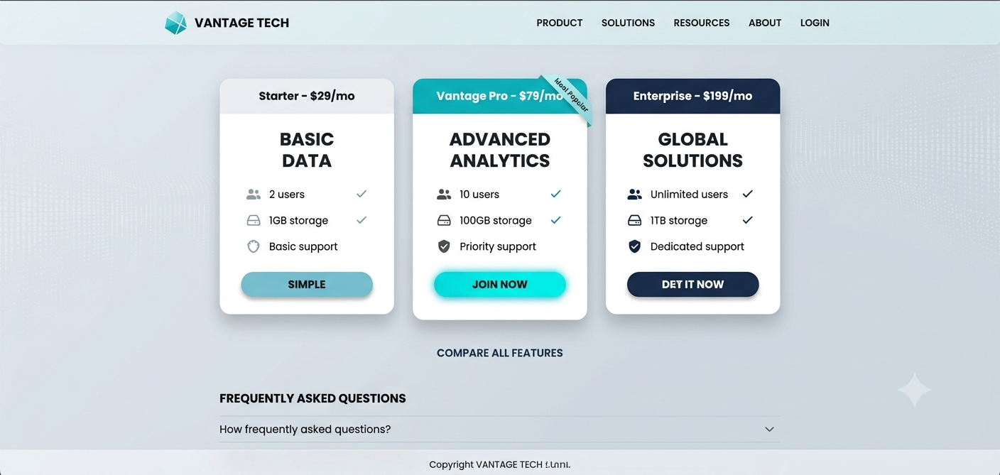 | 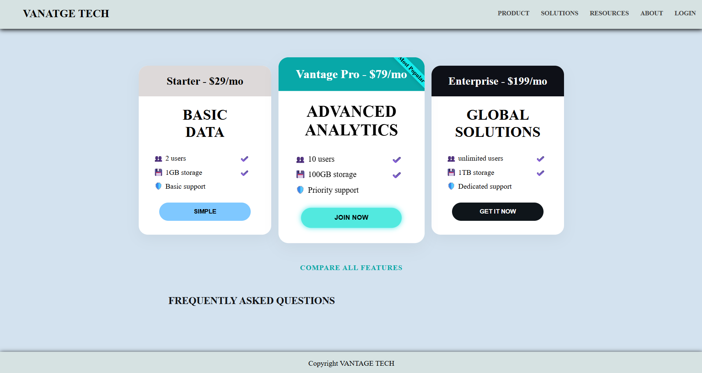 |